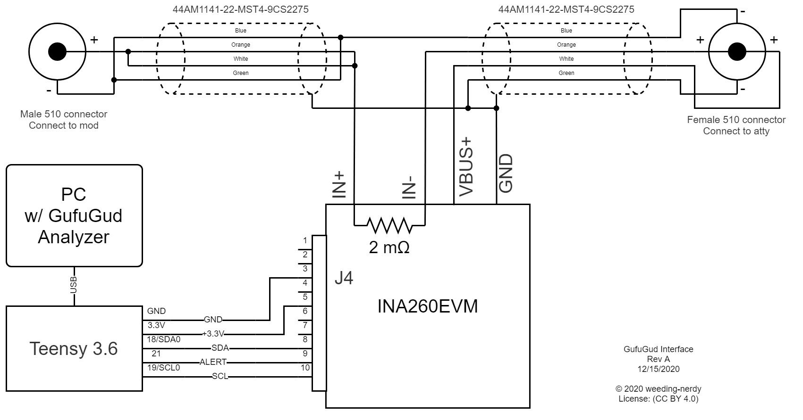

# GufuGud Interface

## Wiring Diagram

## INA260EVM
The TI INA260EVM is a evaluation module from Texas Instruments for the INA260 current/voltage/power monitor IC.

## General advice
Use good practice to create low impedance connections wherever possible, ensure separation of current and voltage loops with Kelvin connections to the female 510 connector. Use star-grounding scheme as shown in the wiring diagram for INA260EVM GND along with the wire shields for the extension cables.

## Bill of Materials
See `gg_interface_BOM.csv` for a Bill of Materials that can be imported into Digikey for the electronics components.

## Wiring diagram source
the file `./gg_interface_wiring_diagram.drawio` is the source file for the wiring diagram, and can be opened with the site: https://app.diagrams.net/
